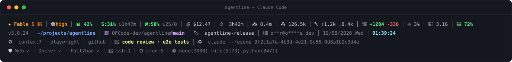

# agentline

**agentline** is a free, zero-dependency bash status line (statusline) for [Claude Code](https://claude.ai/code) that displays session cost, context-window usage, Claude rate limits, git branch, MCP servers, and system health in up to four adaptive lines. It turns the bottom of your terminal into a mission-control panel: model, tokens, running subagents, and the health of the machine itself, rendered by a single bash script.

It is open source under the MIT license, runs on macOS and Linux, and needs nothing beyond the tools already on your machine.




## Why agentline?

Most Claude Code status lines show a model name and a folder. agentline is the most complete one available: it treats the status bar as four distinct layers and uses every column it is given:

1. **Session** — what this conversation costs and consumes, at a glance.
2. **Environment** — where you are: version, path, `owner/repo@branch`, session name, account, clock.
3. **Claude layer** — what Claude is running right now: active MCP servers, live subagents, and a ready-to-paste `claude --resume <session-id>` recovery command.
4. **System layer** — what the host is doing: systemd service health, SSH sessions, cron jobs, listening dev servers.

What makes it different:

- **Zero dependencies.** One bash file using `python3`, `awk`, `git`, `top` — tools already on every macOS and Linux box. No npm, no cargo, no daemon, no network requests.
- **Adaptive layout.** Lines 3 and 4 disappear entirely when they have nothing to say, merge into one line when their combined width fits, and wrap onto continuation rows at segment boundaries when a busy host outgrows the width budget. A quiet laptop gets two lines; a crowded server gets exactly as many as it needs.
- **Crash insurance.** The `♻️ claude --resume` command is always visible, so if Claude Code exits unexpectedly you paste one line and continue where you left off.
- **Host awareness.** Few Claude Code status lines watch your systemd units, SSH sessions, and dev servers — agentline does, so your status bar tells you nginx went down before your monitoring does.
- **Cross-platform from one file.** BSD/GNU differences (`date`, `top`, `vm_stat`, `lsof`/`ss`) are resolved once at startup, not probed per segment.
- **Privacy by default.** The account e-mail is always masked (`o****r@g***l.com`) before it touches the screen.

### agentline vs. typical Claude Code status lines

Most published Claude Code status lines are npm packages that require Node.js, a package install, and sometimes a background process. agentline is a single bash script with no package manager, no Node runtime, and no daemon — clone, run `install.sh`, done.

## Quick start

```bash
git clone https://github.com/OFCode-dev/agentline.git
cd agentline
bash install.sh
```

Restart Claude Code — the status bar appears at the bottom of the terminal.

Add the optional 🔤 word-counter and 🤖 live agent-tracker segments (they need two small [hooks](#optional-hooks-word-counter--agent-tracker)):

```bash
bash install.sh --with-hooks
```

`install.sh` is safe to re-run: it upgrades in place, never overwrites your machine-local service list, and wires hooks idempotently.

## What each line shows

Every `│`-separated segment below is independent: when its value cannot be measured (or is zero/empty), the segment disappears and the pipes close up around it — nothing ever renders as `n/a`.

### Line 1 — Session

| Segment | Meaning | Details |
|---|---|---|
| `✦ Fable 5 🧠` | Model name, parsed from the model id | Colored by family: Fable/Mythos get a `✦` truecolor amber→orange gradient, Opus magenta, Sonnet cyan, Haiku green. `🧠` is attached (no pipe) when extended thinking is on. Hidden only when the payload has no model. |
| `⚡Fast` | Fast mode | Bold yellow. Its own segment; shown only while fast mode is active. |
| `🟠high` | Reasoning effort level | `🟢low` dim · `🟡med` cyan · `🟠high` orange · `🔴xhigh` red · `🔴max` gold. Unknown values render as `⚙️ <level>`. Hidden when the payload has no effort. |
| `📊 42%` | Context window used | Green below 60 %, yellow from 60 %, red from 80 % — and at 80 % the icon swaps to `⚠️` as a deliberate "wrap up or compact" signal. |
| `S:31% ↻2h49m` | 5-hour rate limit | Percentage used: green below 70 %, yellow from 70 %, red from 90 %. `↻` shows the time left until the window resets (`2h49m`), dim; omitted when no reset timestamp is available. |
| `W:58% ↻24/8` | 7-day rate limit | Same color thresholds (70/90). `↻` shows the reset **date** as day/month, dim. |
| `💰 $12.47` | Session cost | USD, two decimals. Hidden when the payload carries no cost. |
| `⏱️ 3h42m` | Session duration | `XhYm`, or `Ym` under an hour. |
| `📥 8.4m` | Input tokens | Abbreviated: `746`, `126.5k`, `8.4m`. |
| `📤 126.5k` | Output tokens | Same abbreviation. |
| `🔤 ↑1.2k ↓8.4k` | Word counter — optional hook | `↑` words you typed, `↓` words Claude wrote, counted from the session transcript (text only, tool noise excluded). Requires the [word-counter hook](#optional-hooks-word-counter--agent-tracker); hidden without it or while both counts are zero. |
| `📝 +1204 -336` | Lines of code changed | Added in green, removed in red. |
| `🔥 37%` | Host CPU usage | 100 − idle, sampled from `top` (BSD variant on macOS). Hidden if unmeasurable. |
| `💾 6.2G` | Used RAM | Linux: `MemTotal − MemAvailable`; macOS: active + wired + compressed pages. |
| `💽 41%` | Root-disk usage | From `df -P /`. Green below 80 %; at 80 % it turns red and gains a `⚠️`. Hidden on mounts that report no percentage. |

### Line 2 — Environment

| Segment | Meaning | Details |
|---|---|---|
| `v3.0.24` | Claude Code version | Dim. |
| `~/projects/agentline` | Working directory | Blue; home-relative (`~` at `$HOME`), absolute outside your home. |
| `🌿 OFCode-dev/agentline@main` | Git branch | Branch in magenta, prefixed with the dim `owner/repo` its `origin` remote points at (SSH and HTTPS remotes both parsed) — so you always know *which* repo's `main` you are on. Repos without an origin show the branch alone; non-repos hide the segment. |
| `🏷️ session-name` | Named session | Truncated at 30 chars; hidden for unnamed sessions. |
| `🤖 o****r@g***l.com` | Active Claude account | Always masked before display (first/last characters kept, middle starred). Taken from the payload when present, otherwise from `claude auth status` cached for 60 s — account switches appear within a minute. Hidden when neither source yields an address. |
| `19/08/2026 Wed` | Date | `dd/mm/yyyy Day`, dim; the day abbreviation is pinned to English regardless of host locale. |
| `01:39:24` | Clock | `HH:MM:SS`, cyan. System timezone by default; pin with `AGENTLINE_TZ` (e.g. home time on a UTC server). |

### Line 3 — Claude layer

| Segment | Meaning | Details |
|---|---|---|
| `⚙️ context7 · playwright` | Active MCP servers | Global and per-project servers from `~/.claude.json`, merged. Command-based servers count only if their process is actually running (`pgrep`-checked); remote HTTP/SSE servers count as configured. Hidden when none are active. |
| `🤖 code review · tests` | Live subagents — optional hook | Entries fresher than 5 minutes from the [agent-tracker hook](#optional-hooks-word-counter--agent-tracker), labels truncated at 25 chars, yellow. Cleared when the main session stops. |
| `♻️ claude --resume <id>` | Recovery command | Ready to paste after a crash to resume this exact session. Prefers the session **id** (what `--resume` accepts); falls back to the quoted session name, which `--resume` treats as a picker search term. |

### Line 4 — System layer

| Segment | Meaning | Details |
|---|---|---|
| `🛡️ Web ✓ · DB ✓ · Cache ✗` | Service health | One entry per systemd unit you listed in `~/.claude/agentline-services.conf` (see below). Healthy units render dim `Label ✓` — deliberately unobtrusive; a down unit renders bold red `Label ✗` so only failures draw the eye. Units not defined on the host are skipped silently; the whole panel hides on macOS (no systemd) or without a config file. |
| `🔐 ssh:2` | Remote SSH sessions | Counted from `who` (entries with an origin host). Dim at 1; bold yellow above 1, so an unexpected second login stands out. Hidden at 0. |
| `⏰ cron:5` | User cron jobs | Non-empty, non-comment lines of `crontab -l`. Dim; hidden when the crontab is empty or missing. |
| `🌐 node(3000) vite(5173)` | Listening dev servers | Your processes listening on TCP ports 3000–9999 (`ss` on Linux, `lsof` on macOS), shown as `process(port)`. System daemons outside that range are excluded. Hidden when nothing listens. |

Lines 3 and 4 are omitted when empty, joined into one line when the combined width fits within 120 columns, and wrapped onto continuation rows at segment (`│`) boundaries when either grows past that budget — a segment is never split mid-way. Tune the budget with `AGENTLINE_WIDTH` (set it near your real terminal width). That is by design: information density without wasted rows or overflow.

## Service health panel

The units on line 4 come from a **machine-local** file, `~/.claude/agentline-services.conf` — deliberately gitignored so every machine keeps its own list while the repo stays shared:

```
nginx:Web
postgresql:DB
redis-server:Cache
```

One `systemd-unit:Label` per line; `#` comments and blank lines ignored; omit the label to use the unit name. Units that don't exist on a host are skipped silently, so the same file can be copied between machines. `install.sh` seeds it from `agentline-services.conf.example` on first run and never overwrites it afterwards. The panel is Linux-only (systemd); on macOS it simply stays hidden.

## Configuration

Everything is optional — agentline works with zero configuration.

| Variable | Default | Effect |
|---|---|---|
| `AGENTLINE_SERVICES` | `~/.claude/agentline-services.conf` | Path to the service list |
| `AGENTLINE_WIDTH` | `120` | Column budget for merging and wrapping lines 3 + 4 |
| `AGENTLINE_TZ` | system timezone | Pin the clock, e.g. `Europe/Istanbul` on a UTC server |

Set them in the `env` block of `~/.claude/settings.json` so Claude Code passes them to every render:

```json
{
  "env": { "AGENTLINE_TZ": "Europe/Istanbul" }
}
```

## Optional hooks: word counter + agent tracker

Two segments read files that Claude Code itself does not provide, so they are fed by two small hooks shipped in [`hooks/`](hooks/):

- **`wordcount-hook.sh`** — counts words in the transcript (PostToolUse + Stop) and feeds `🔤 ↑in ↓out` on line 1.
- **`agent-tracker-hook.sh`** — records subagent spawns (PreToolUse on Agent) and clears them on Stop, feeding `🤖` on line 3.

`bash install.sh --with-hooks` copies them to `~/.claude/agentline/` and adds the hook entries to `settings.json` idempotently — existing hooks are never duplicated or removed. Without them, the two segments simply stay hidden; nothing else changes.

## Manual install

Copy `agentline.sh` anywhere and point `~/.claude/settings.json` at it:

```json
{
  "statusLine": {
    "type": "command",
    "command": "/path/to/agentline.sh"
  }
}
```

## How it works

Claude Code invokes the `statusLine` command on every render and pipes a JSON payload (model, context window, rate limits, cost, session, workspace) to stdin. agentline extracts every field in a single `python3` pass, probes the host with standard tools (`top`, `df`, `who`, `ss`/`lsof`, `systemctl`, `crontab`), assembles up to four ANSI-colored lines, and prints them. One pass, no daemons, and no network requests of its own. Segments that cannot be measured on the current platform vanish instead of erroring — the same file runs unmodified on macOS and Linux.

## Requirements

- Claude Code ≥ 2.x
- `bash`, `python3`, `git`, `awk`, `top` — standard on macOS and Linux
- Optional: `systemctl` (Linux) for the service panel

## FAQ

**Does agentline show my Claude rate limits?**
Yes. Line 1 shows both the 5-hour rate limit (`S:31% ↻2h49m`) and the 7-day rate limit (`W:58% ↻24/8`) — percentage used and time until reset, updated on every render.

**Why are lines 3 and 4 sometimes missing?**
They hide when empty, merge when short, and wrap onto extra rows when crowded — a status bar should spend rows on information, not on structure. See [Adaptive layout](#why-agentline).

**Does agentline slow Claude Code down?**
No. Rendering is a single pass of one bash script with a few short-lived `python3` helpers; there are no daemons and no network calls. Claude Code renders the status line asynchronously, so your prompt never waits on it.

**Does it work on macOS?**
Yes — CPU, memory, and listening-port probes have BSD branches selected once at startup. Only the systemd service panel is Linux-specific, and it degrades to nothing on macOS.

**Why don't I see the 🔤 word counts or the 🤖 agents?**
Those two segments are fed by the optional hooks. Run `bash install.sh --with-hooks`.

**Is my e-mail address exposed on screen shares?**
It is always masked (`o****r@g***l.com`) before display, and it never leaves your machine.

**How do I customize segments or colors?**
Edit `agentline.sh` directly — sections are marked with `# ===` comments, and each segment is an independent block you can delete or reorder freely.

**How do I uninstall?**
Remove the `statusLine` entry from `~/.claude/settings.json` and delete `~/.claude/agentline/` (plus `~/.claude/agentline-services.conf` if you no longer want the service list).

## License

[MIT](LICENSE) © 2026 Omer Faruk Bayrak
