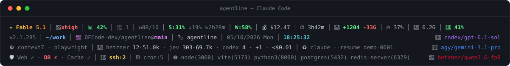

# agentline

**agentline** is a free, zero-dependency bash status line (statusline) for [Claude Code](https://claude.ai/code) that displays session cost, context-window usage, Claude rate limits, git branch, MCP servers, and system health in up to four adaptive lines. It turns the bottom of your terminal into a mission-control panel: model, tokens, running subagents, and the health of the machine itself, rendered by a single bash script.

It is open source under the MIT license, runs on macOS and Linux, and needs nothing beyond the tools already on your machine.




## Why agentline?

Most Claude Code status lines show a model name and a folder. agentline is the most complete one available: it treats the status bar as four distinct layers and uses every column it is given:

1. **Session** — what this conversation costs and consumes, at a glance.
2. **Environment** — where you are: version, path, `owner/repo@branch`, session name, account, clock.
3. **Claude layer** — what Claude is running right now: active MCP servers, live subagents, and a ready-to-paste `claude --resume <session-id>` recovery command.
4. **System layer** — what the host is doing: systemd service health, SSH sessions, cron jobs, listening dev servers.

What makes it different:

- **Zero dependencies.** One bash file using `python3`, `awk`, `git`, `top` — tools already on every macOS and Linux box. No npm, no cargo, no daemon, no network requests.
- **Adaptive layout.** Lines 3 and 4 disappear entirely when they have nothing to say, merge into one line when their combined width fits, and wrap onto continuation rows at segment boundaries when a busy host outgrows the width budget. A quiet laptop gets two lines; a crowded server gets exactly as many as it needs. On a narrow terminal the least important segments step aside first, and one `AGENTLINE_LAYOUT` string picks, orders and groups segments without touching the script.
- **Crash insurance.** The `♻️ claude --resume` command is always visible, so if Claude Code exits unexpectedly you paste one line and continue where you left off.
- **Host awareness.** Few Claude Code status lines watch your systemd units, SSH sessions, and dev servers — agentline does, so your status bar tells you nginx went down before your monitoring does.
- **Cross-platform from one file.** BSD/GNU differences (`date`, `top`, `vm_stat`, `lsof`/`ss`) are resolved once at startup, not probed per segment.
- **Privacy by default.** The account e-mail is always masked (`o****r@g***l.com`) before it touches the screen.

### agentline vs. typical Claude Code status lines

Most published Claude Code status lines are npm packages that require Node.js, a package install, and sometimes a background process. agentline is a single bash script with no package manager, no Node runtime, and no daemon — clone, run `install.sh`, done.

## Quick start

```bash
git clone https://github.com/OFCode-dev/agentline.git
cd agentline
bash install.sh
```

Restart Claude Code — the status bar appears at the bottom of the terminal.

agentline is also an installable [agent skill](SKILL.md): `npx skills add OFCode-dev/agentline` teaches your agent how to install and configure it for you.

Add the optional 🔤 word-counter and 🤖 live agent-tracker segments (they need two small [hooks](#optional-hooks-word-counter--agent-tracker)):

```bash
bash install.sh --with-hooks
```

`install.sh` is safe to re-run: it upgrades in place, never overwrites your machine-local service list, and wires hooks idempotently. It treats `~/.claude/settings.json` as yours:

- A `settings.json` that is not valid JSON is refused with the line number. Nothing is rewritten.
- A timestamped backup (`settings.json.agentline-bak-YYYYmmdd-HHMMSS`, UTC, newest 5 kept) is taken before any edit, and the new file is swapped in atomically. A symlinked `settings.json` stays a symlink; it is edited, and its backups are written, next to the link's **target** (e.g. inside your dotfiles repo). A `settings.json` bind-mounted on its own (devcontainers) cannot be swapped, so it is rewritten in place after the backup.
- A status line that is not agentline (`npx ccstatusline`, your own `~/.claude/statusline.sh`, …) is left untouched. The installer prints the snippet to paste instead, says agentline is installed but **not active**, skips `--with-hooks`, and exits with status `3`. Pass `--force` to switch anyway. A `statusline.sh` / `statusline-command.sh` is migrated automatically only when it is provably agentline's own pre-rename copy: the file carries agentline's header line or reads `statusline-services.conf`, or the command is a single absolute path to a file that no longer exists. Its name or directory alone never counts, because those are the usual names of other status lines too.
- agentline run through a wrapper (`bash -c "AGENTLINE_TZ=UTC exec ~/.claude/agentline/agentline.sh"`, or piped through `sed`) counts as active. The copy the wrapper runs is upgraded in place and the wrapper is left as it is.
- Exit status: `0` installed and active, `1` `settings.json` unusable or unwritable (refused before anything is copied, or the write failed and the file was left whole next to its backup), `2` bad option, `3` installed but not active.
- If the installed `agentline.sh` differs from the new one, it is kept as `agentline.sh.bak-<timestamp>` before being replaced. Put your tweaks in [`local.sh`](#faq) so they survive upgrades.

## What each line shows

Every `│`-separated segment below is independent: when its value cannot be measured (or is zero/empty), the segment disappears and the pipes close up around it — nothing ever renders as `n/a`.

### Line 1 — Session

| Segment | Meaning | Details |
|---|---|---|
| `⚠ payload` | Payload could not be read | Dim, and shown first on line 1 only when Claude Code's stdin is not a JSON object. The model and context segments need the payload, so they are missing; host, git and clock segments still render. Empty stdin (a manual run) does not show it. |
| `✦ Fable 5 🧠` | Model name, parsed from the model id | Colored by family: Fable/Mythos get a `✦` truecolor amber→orange gradient, Opus magenta, Sonnet cyan, Haiku green. `🧠` is attached (no pipe) when extended thinking is on. `model` is accepted both as an object (`{id, display_name}`) and as a bare id string, since the shape has changed between versions. Hidden only when the payload has no model. |
| `⚡Fast` | Fast mode | Bold yellow. Its own segment; shown only while fast mode is active. |
| `🟠high` | Reasoning effort level | `🟢low` dim · `🟡med` cyan · `🟠high` orange · `🔴xhigh` red · `ultracode` bold white on a violet gradient · `max` static rainbow, both mirroring the `/effort` picker's styling. The scale runs low < medium < high < xhigh < max, with ultracode as a side mode (xhigh + workflows). Unknown values render as `⚙️ <level>`. Hidden when the payload has no effort. |
| `📊 42%` | Context window used | Green below 60 %, yellow from 60 %, red from 80 % — and at 80 % the icon swaps to `⚠️` as a deliberate "wrap up or compact" signal. On a window larger than 200k (the 1M models), Claude Code's `exceeds_200k_tokens` flag also turns it into a yellow `⚠️ 25% >200k`, because a low percentage there can already be past the 200k mark where long-context pricing starts. On a 200k window that flag only repeats the percentage, so it is ignored. The percentage is the payload's own `used_percentage` of the full window. It is not measured against the auto-compact threshold: the payload does not expose that threshold, so 100 % does not mean "compact now". Right after a compaction the payload has no figure until the next API call; then a dim `📊 ~16%` estimate (the compaction's `postTokens` over the window size) stands in until the real one returns. |
| `🔄 2` | Compactions this session | Dim; how many times the context has been compacted (`/compact` or auto-compact), counted from the `compact_boundary` entries in the session transcript. Hidden at 0. The transcript is read incrementally (only bytes added since the last render), so a long session costs one `stat` per render. |
| `S:71% ⇡12% ↻2h0m` | 5-hour rate limit | Percentage used: green below 70 %, yellow from 70 %, red from 90 %. `⇡`/`⇣` is the **pace**: used % minus the share of the window already elapsed (the window started `resets_at` − 5 h ago). `⇡12%` means you are 12 points ahead of a flat pace and will hit the limit before the reset if you keep going (yellow from 5, red from 15); a dim `⇣12%` is headroom. Within ±5 points, in the first 30 minutes of a window, or when the reset time is missing, past or not an epoch, no arrow is shown. The percentage keeps its own colour, so 92 % stays red even when it is under pace. `AGENTLINE_PACE=0` turns the arrows off. `↻` shows the time left until the window resets (`2h49m`), dim; omitted when no reset timestamp is available. |
| `W:58% F:12% ↻24/8` | 7-day rate limit | `W:` is the account-wide weekly percentage, same color thresholds as `S:` (70/90), followed by its pace arrow like `S:` (`W:58% ⇡8%`), measured over 7 days and shown only after the first ~5 hours of the week. `F:` is the **premium-model** share of that week — Fable/Opus — in orange, read from `rate_limits.seven_day_overage_included` (Claude Code's own label for that bucket is "Fable 5 limit"), falling back to `rate_limits.seven_day_opus`. Claude Code 2.1.x only forwards header-borne buckets to the status line, and many accounts receive no per-model header at all; for those, set `AGENTLINE_USAGE_API=1` to read the Fable share from the `/usage` endpoint instead (one cached HTTPS request per `AGENTLINE_USAGE_TTL`). It carries its own color on purpose: `W` answers "how close am I to the wall", `F` answers "how much of that is the expensive model". Either half is omitted when the payload lacks it, and the whole segment disappears when both are missing. `↻` shows the reset **date** as day/month, dim. |
| `🗄️ cold·tools ~45k` | Prompt cache — only when it matters | From Claude Code's `prompt_cache` object (Claude Code ≥ 2.1.251; the miss cause needs ≥ 2.1.260). Hidden while the cache is warm, because warm is normal. It appears in yellow as `🗄️ ↻1m12s`, a live countdown, once the warm cache has at most 60 s left on a 5-minute TTL (5 minutes on a 1-hour TTL, or `AGENTLINE_CACHE_WARN` seconds): send the follow-up now and it stays cheap. When the cache has gone cold it shows in red as `🗄️ cold·<cause>`, meaning the next turn pays full input price. A cache past its `expires_at` reads `cold·ttl`, even if the payload still says warm or recorded a different miss earlier — a miss re-writes the cache, so it is warm again right after one, and the segment stays hidden then. Only when the payload has no expiry at all (the latest response wrote no cache) is Claude Code's first `last_miss_cause` shown instead, shortened: `ttl`, `tools` (tools changed), `prompt` (system prompt changed), `model`, `effort`, `server`, and so on; plain `cold` when no cause was identified. The dim `~45k` is how many tokens going cold re-writes, when Claude Code reports it. `AGENTLINE_CACHE_VERBOSE=1` also shows the session hit ratio (`🗄️ 91%`: red below 25 %, yellow below 75 %). Hidden on older Claude Code, before the first API response, and when the provider reports no caching (`caching_observed: false`). |
| `💰 $12.47` | Session cost | USD, two decimals. Hidden when the payload carries no cost. |
| `⏱️ 3h42m` | Session duration | `XhYm`, or `Ym` under an hour. |
| `📥 8.4m` | Input tokens | Abbreviated: `746`, `126.5k`, `8.4m`. |
| `📤 126.5k` | Output tokens | Same abbreviation. |
| `🔤 ↑1.2k ↓8.4k` | Word counter — optional hook | `↑` words you typed, `↓` words Claude wrote, counted from the session transcript (text only, tool noise excluded). Requires the [word-counter hook](#optional-hooks-word-counter--agent-tracker); hidden without it or while both counts are zero. |
| `📝 +1204 -336` | Lines of code changed | Added in green, removed in red. |
| `🔥 37%` | Host CPU usage | 100 − idle, sampled from `top` (BSD variant on macOS). Hidden if unmeasurable. |
| `💾 6.2G` | Used RAM | Linux: `MemTotal − MemAvailable`; macOS: active + wired + compressed pages. |
| `💽 41%` | Root-disk usage | From `df -P /`. Green below 80 %; at 80 % it turns red and gains a `⚠️`. Hidden on mounts that report no percentage. |

### Line 2 — Environment

| Segment | Meaning | Details |
|---|---|---|
| `v3.0.24` | Claude Code version | Dim. |
| `~/projects/agentline` | Working directory | Blue; home-relative (`~` at `$HOME`), absolute outside your home. When the session has changed directory away from where Claude Code was launched (`workspace.project_dir`), a dim breadcrumb with the launch folder's name leads it: `↖ agentline ~/src/other`. |
| `🌿 OFCode-dev/agentline@main` | Git branch | Branch in magenta, prefixed with the dim `owner/repo` its `origin` remote points at (SSH and HTTPS remotes both parsed) — so you always know *which* repo's `main` you are on. Repos without an origin show the branch alone; non-repos hide the segment. With an `https://` origin the `owner/repo` part is a clickable link (see `AGENTLINE_LINKS`). After the branch: `↑2↓1`, commits ahead of / behind its upstream, and a dim `±3 ?2 ✖1` for changed, untracked and conflicted files, each part hidden at zero (e.g. `🌿 OFCode-dev/agentline@main ↑2 ±3`). They come from one `git status --porcelain=v2 --branch`, run lock-free under a 1 s timeout and reused for `AGENTLINE_PROBE_TTL`, so they can trail an edit by up to 15 s. Without a `timeout` (or Homebrew `gtimeout`) binary the call is skipped and the branch shows alone; `AGENTLINE_GIT_UNTRACKED=0` skips the untracked scan (the slow part on a large repo), `AGENTLINE_GIT_STATUS=0` turns the counts off. A repository's own `.git/config` never gets to run a command: the call pins `core.fsmonitor` and hooks off, does not descend into submodules, and is skipped (branch alone) when the repo's config defines a filter, an include or a transport command, or when the repo is not yours — so `cd` into an unpacked tarball is safe. |
| `🔀 ✅ #1234` | Pull request | From Claude Code's `pr` object: the review state (`📝` draft, `👀` pending, `🔴` changes requested, `✅` approved; none for any other state), then the number, a clickable link to the PR. A GitLab merge request shows as `!1234` (needs Claude Code ≥ 2.1.234). The footer already shows the PR number; the review state and the link are what this adds. Hidden when the branch has no PR. |
| `🌳 feat-login` | Linked worktree | Shown only when the session runs in a linked worktree (`git worktree add`, from `workspace.git_worktree`, or a Claude Code worktree session's `worktree.name`), so parallel sessions can tell their checkouts apart. Hidden in the main clone. |
| `🏷️ session-name` | Named session | Truncated at 30 chars; hidden for unnamed sessions. |
| `🤖 o****r@g***l.com` | Active Claude account | Always masked before display (first/last characters kept, middle starred). Taken from the payload when present, otherwise from `claude auth status` cached for 60 s — account switches appear within a minute. Hidden when neither source yields an address. |
| `19/08/2026 Wed` | Date | `dd/mm/yyyy Day`, dim; the day abbreviation is pinned to English regardless of host locale. |
| `01:39:24` | Clock | `HH:MM:SS`, cyan, and it **ticks live** — `install.sh` sets `statusLine.refreshInterval` to 1 s, and agentline serves those ticks from a render cache so a second costs no subprocesses. System timezone by default; pin with `AGENTLINE_TZ` (e.g. home time on a UTC server). |

### Line 3 — Claude layer

| Segment | Meaning | Details |
|---|---|---|
| `⚙️ context7 · playwright` | Active MCP servers | Global and per-project servers from `~/.claude.json`, merged. Command-based servers count only if their process is actually running (`pgrep`-checked); remote HTTP/SSE servers count as configured. Hidden when none are active. |
| `🤖 code review · tests · +2 · ✓explore` | Live subagents — optional hook | Entries fresher than 5 minutes, labels truncated at 25 chars, yellow. At most `AGENTLINE_AGENT_SHOW` (default 4) are listed, oldest first; the rest are counted as `+N`. A subagent that just finished flashes green as `✓label` for ten seconds. Claude's own subagents come from the [agent-tracker hook](#optional-hooks-word-counter--agent-tracker) and clear when each one stops. Any other process can [register itself](#showing-external-agents) and stays until it deregisters or goes stale. |
| `♻️ claude --resume <id>` | Recovery command | Ready to paste after a crash to resume this exact session. Prefers the session **id** (what `--resume` accepts); falls back to the quoted session name, which `--resume` treats as a picker search term. |

### Line 4 — System layer

| Segment | Meaning | Details |
|---|---|---|
| `🛡️ Web ✓ · DB ✓ · Cache ✗` | Service health | One entry per systemd unit you listed in `~/.claude/agentline-services.conf` (see below). Healthy units render dim `Label ✓` — deliberately unobtrusive; a down unit renders bold red `Label ✗` so only failures draw the eye. Units not defined on the host are skipped silently; the whole panel hides on macOS (no systemd) or without a config file. |
| `🔐 ssh:2` | Remote SSH sessions | Counted from `who` (entries with an origin host). Dim at 1; bold yellow above 1, so an unexpected second login stands out. Hidden at 0. |
| `⏰ cron:5` | User cron jobs | Non-empty, non-comment lines of `crontab -l`. Dim; hidden when the crontab is empty or missing. |
| `🌐 node(3000) vite(5173)` | Listening dev servers | Your processes listening on TCP ports 3000–9999 (`ss` on Linux, `lsof` on macOS), shown as `process(port)`. System daemons outside that range are excluded. Hidden when nothing listens. |

Lines 3 and 4 are omitted when empty, joined into one line when the combined width fits, and wrapped onto continuation rows at segment (`│`) boundaries when either grows past the width — a segment is never split mid-way. That is by design: information density without wasted rows or overflow. The width is your live terminal width (Claude Code ≥ 2.1.153 passes it as `COLUMNS`), otherwise 120; on a terminal narrower than line 1 or 2, low-priority segments give way first — see [Layout and narrow terminals](#layout-and-narrow-terminals).

## Service health panel

The units on line 4 come from a **machine-local** file, `~/.claude/agentline-services.conf` — deliberately gitignored so every machine keeps its own list while the repo stays shared:

```
nginx:Web
postgresql:DB
redis-server:Cache
```

One `systemd-unit:Label` per line; `#` comments and blank lines ignored; omit the label to use the unit name. Units that don't exist on a host are skipped silently, so the same file can be copied between machines. `install.sh` seeds it from `agentline-services.conf.example` on first run and never overwrites it afterwards. The panel is Linux-only (systemd); on macOS it simply stays hidden.

## Configuration

Everything is optional — agentline works with zero configuration.

| Variable | Default | Effect |
|---|---|---|
| `AGENTLINE_SERVICES` | `~/.claude/agentline-services.conf` | Path to the service list |
| `AGENTLINE_LAYOUT` | the four lines above | Which segments show, in what order, on which line — see [Layout and narrow terminals](#layout-and-narrow-terminals) |
| `AGENTLINE_DROP` | `tok_in,tok_out,words,compact,dur,date,version,email,lines,cpu,mem,disk,cache` | Segments that give way on a line too wide for the terminal, lowest priority first. `model`, `ctx`, `5h` and `week` are never dropped, and neither is a segment showing a warning (disk ≥ 80 %, a cold or expiring cache, a failed service). Set to empty to wrap instead of dropping anything |
| `AGENTLINE_WIDTH` | live terminal width − 2, else `120` | Column budget for fitting, merging and wrapping lines. Overrides the live width when set |
| `AGENTLINE_TZ` | system timezone | Pin the clock, e.g. `Europe/Istanbul` on a UTC server |
| `AGENTLINE_PACE` | `1` | Set to `0` to hide the `⇡`/`⇣` pace arrows after `S:` and `W:` |
| `AGENTLINE_AGENT_SHOW` | `4` | How many running agents `🤖` lists before it counts the rest as `+N` |
| `AGENTLINE_THEME` | `dark` | `light` or `mono` (also selected by `NO_COLOR`) — see [Themes, glyphs and colours](#themes-glyphs-and-colours) |
| `AGENTLINE_GLYPHS` | `emoji` | `ascii` for a line with nothing above U+007F |
| `AGENTLINE_COLOR_*` | unset | `GOLD`, `ORANGE`, `FABLE_FROM`, `FABLE_TO` as `r,g,b` |
| `AGENTLINE_CACHE_WARN` | `60` (5m TTL), `300` (1h TTL) | Seconds before a warm prompt cache expires at which the `🗄️ ↻` countdown appears |
| `AGENTLINE_CACHE_VERBOSE` | unset | Set to `1` to always show the prompt-cache hit ratio (`🗄️ 91%`) |
| `AGENTLINE_GIT_STATUS` | `1` | Set to `0` to skip the `git status` call behind the `↑↓` ahead/behind and `±?✖` dirty counts on the git segment |
| `AGENTLINE_GIT_UNTRACKED` | `1` | Set to `0` to leave untracked files out of that call (`-uno`), which is what makes `git status` slow on very large repositories |
| `AGENTLINE_LINKS` | `1` | Set to `0` for plain text instead of clickable OSC-8 links on the PR number and `owner/repo`. Links are off by themselves inside tmux, screen and zellij, which strip them. Whether the terminal itself takes links is Claude Code's call (`FORCE_HYPERLINK=1` forces it) |
| `AGENTLINE_CACHE_TTL` | `5` | Seconds a cached render may serve clock ticks before the line is rebuilt |
| `AGENTLINE_PROBE_TTL` | `15` | Seconds the host layer (CPU, RAM, disk, ports, services, MCP, git) may be reused. Independent of the render cache, and unaffected by payload changes — see below |
| `AGENTLINE_USAGE_API` | unset | Set to `1` to fetch the Fable weekly share (`F:`) from `https://api.anthropic.com/api/oauth/usage` when the payload carries no per-model bucket. This is the **only** network call agentline can make, and only when you opt in. Uses the OAuth token from `.credentials.json` in your profile directory (`$CLAUDE_CONFIG_DIR`, default `~/.claude`); the token never leaves the python helper. The result is cached per profile, so two profiles never show each other's figure. Once the cache expires, only one of your open sessions makes the request, in the background so the render never waits on the network (the previous figure stays up meanwhile, for at most a minute past the TTL); it gives up after 20 s. On macOS the token lives in the Keychain rather than in `.credentials.json`, so `F:` stays hidden there |
| `AGENTLINE_USAGE_TTL` | `300` | Seconds a fetched `/usage` result is reused before the endpoint is asked again |
| `AGENTLINE_LOCAL` | `~/.claude/agentline/local.sh` | Your override file, sourced on every full render if it exists (see [FAQ](#faq)) |
| `AGENTLINE_TMP` | `/tmp` | Directory for the files the optional hooks write (`claude_wordcount.txt`, `claude_agents.txt`). agentline and the hooks read the same variable, so set it for both — e.g. a per-user directory on a shared host |

Set them in the `env` block of `~/.claude/settings.json` so Claude Code passes them to every render:

```json
{
  "env": { "AGENTLINE_TZ": "Europe/Istanbul" }
}
```

### Layout and narrow terminals

`AGENTLINE_LAYOUT` is one string: `/` starts a line, `,` separates segment names, and a segment you leave out is hidden. Order and grouping are exactly what you write; empty lines collapse, and unknown names are ignored. The default is today's four lines:

```
model,effort,fast,ctx,compact,5h,week,cache,cost,dur,tok_in,tok_out,words,lines,cpu,mem,disk / version,dir,git,pr,worktree,session,email,date,clock / mcp,agents,resume / services,ssh,cron,ports
```

| Name | Segment | Name | Segment |
|---|---|---|---|
| `model` | model name | `version` | Claude Code version |
| `effort` | effort level | `dir` | folder |
| `fast` | ⚡Fast | `git` | 🌿 repo@branch |
| `ctx` | 📊 context used | `session` | 🏷️ session name |
| `5h` | `S:` 5-hour limit | `email` | 🤖 masked account |
| `week` | `W:`/`F:` weekly limits | `date` | date |
| `cache` | 🗄️ prompt cache | `clock` | live clock |
| `cost` | 💰 cost | `mcp` | ⚙️ MCP servers |
| `dur` | ⏱️ duration | `agents` | 🤖 live subagents |
| `tok_in` / `tok_out` | 📥 / 📤 tokens | `resume` | ♻️ resume command |
| `words` | 🔤 word counts | `services` | 🛡️ service health |
| `lines` | 📝 lines changed | `ssh` / `cron` / `ports` | 🔐 / ⏰ / 🌐 |
| `cpu` / `mem` / `disk` | 🔥 / 💾 / 💽 | `pr` | 🔀 pull / merge request |
| `compact` | 🔄 compactions | `worktree` | 🌳 linked worktree |

A compact two-line bar, for example:

```json
{
  "env": { "AGENTLINE_LAYOUT": "model,effort,ctx,5h,week,cost / dir,git,clock" }
}
```

**Narrow terminals.** Claude Code ≥ 2.1.153 tells the status line the terminal width (`COLUMNS`); agentline takes 2 cells off as a margin, because the value is read when the render starts and can trail a resize. When a line is wider than that, segments are dropped from it in `AGENTLINE_DROP` order until it fits, and whatever still does not fit wraps at `│` boundaries. A line that has to wrap anyway gets its dropped segments back, most important first, wherever they fit without adding a row. The model, context and both rate limits are never dropped. A resize takes effect on the next tick — the width is part of the render cache key. On older Claude Code there is no `COLUMNS`, so the width is a guess (120, or `AGENTLINE_WIDTH`) and lines 1 and 2 are never trimmed on a guess; set `AGENTLINE_DROP` to opt in anyway.

### Themes, glyphs and colours

Most of agentline's colours are the terminal's own ANSI roles (green, yellow, red, dim), which your terminal theme already maps to something readable on its background. A theme only swaps the colours that are fixed values: the Fable gradient, the gold/orange accents, and the animated `max` rainbow.

| Variable | Values | Effect |
|---|---|---|
| `AGENTLINE_THEME` | `dark` (default), `light`, `mono` | `light` darkens the fixed colours to 4–7:1 contrast on white (the dark-theme amber is about 1.4:1 there). `mono` prints no colour at all and shows the `max`/`ultracode` effort words without animation. A non-empty [`NO_COLOR`](https://no-color.org) selects `mono` too |
| `AGENTLINE_GLYPHS` | `emoji` (default), `ascii` | `ascii` prints nothing above U+007F: icons become short words (`cpu:37%`, `git:owner/repo@main`) or disappear where the value speaks for itself (`$12.47`, `ssh:2`), `│` becomes `\|`, `·` becomes `/`, `✓`/`✗` become `ok`/`FAIL`. For fonts without emoji, and for logs |
| `AGENTLINE_COLOR_GOLD`, `AGENTLINE_COLOR_ORANGE` | `r,g,b` (0–255) | Replace the gold and orange accents (orange: `high` effort, `F:`) |
| `AGENTLINE_COLOR_FABLE_FROM`, `AGENTLINE_COLOR_FABLE_TO` | `r,g,b` | The endpoints of the Fable/Mythos model-name gradient |

A malformed `r,g,b` is ignored as a whole. Set these in the `env` block of `settings.json`, which upgrades never touch, or let the installer do it: `bash install.sh --theme light`, `bash install.sh --glyphs ascii`. The installer does not detect your background. The terminal it runs in is often not the one the status line is drawn in, and the only way to ask is an escape-sequence round trip that many setups (SSH, tmux, Claude Code's own shell) cannot answer. When your terminal sets `COLORFGBG` to a light background, the installer mentions `--theme light` and writes nothing.

## Optional hooks: word counter + agent tracker

Two segments read files that Claude Code itself does not provide, so they are fed by two small hooks shipped in [`hooks/`](hooks/):

- **`wordcount-hook.sh`** — counts words in the transcript (PostToolUse + Stop) and feeds `🔤 ↑in ↓out` on line 1.
- **`agent-tracker-hook.sh`** — follows each subagent through its lifecycle and feeds `🤖` on line 3. The row appears on the dispatch (PreToolUse on Agent), under the tool call's description. `SubagentStart` ties it to the agent (`review diff #a1b2c3`, the first six characters of `agent_id`). `SubagentStop` removes that agent alone the moment it finishes and flashes `✓review diff` for about ten seconds. `Stop` clears whatever the session still owns, as a safety net. Internal agents (prompt suggestions, `/btw`) are ignored. The hook dispatches on `hook_event_name`, so one script serves all four events. Claude Code releases without `SubagentStart` keep the old behaviour: the row appears on dispatch and clears at the end of the turn.
- **`agentline-agent.sh`** — the locked registry both of the above write through, and the entry point for anything else that wants a row on line 3 (see below).

`bash install.sh --with-hooks` copies them to `~/.claude/agentline/` and adds the hook entries to `settings.json` idempotently — existing hooks are never duplicated or removed. Without them, the two segments simply stay hidden; nothing else changes.


### Showing external agents

`🤖` is not limited to Claude's own subagents. During an orchestration the
expensive, slow work is often an external agent CLI — `codex`, `agy`, an SDK
run on another host — and those used to be invisible: the bar showed the
subagents and nothing else, so a run that took ten minutes looked like a hang.

Any process can take a row. The contract is one file,
`claude_agents.txt` in `$AGENTLINE_TMP` (default `/tmp`), one entry per line, `<epoch> <label>`; agentline
renders entries younger than five minutes. Write through the helper rather
than appending by hand — it takes a lock, so parallel dispatch cannot lose an
entry, and it replaces a row that already carries the same label instead of
appending a duplicate:

```bash
AL=~/.claude/agentline/agentline-agent.sh
label="codex round 1"

"$AL" add "$label"
while :; do sleep 30; "$AL" add "$label"; done &   # heartbeat
hb=$!
trap 'kill "$hb" 2>/dev/null; "$AL" remove "$label"' EXIT

codex exec ...        # the bar shows "codex round 1" for as long as this runs
```

The heartbeat is what keeps the row alive past the five-minute window; without
it a longer run simply ages out of the display. If the process dies without
running its trap, the row disappears on its own once it goes stale.

Rows are only ever removed by whoever put them there: the agent-tracker hook
clears its own session's subagents on `SubagentStop` and `Stop` and leaves
everything else alone, so an external run in progress survives the end of an
assistant turn.

The segment shows the first `AGENTLINE_AGENT_SHOW` (default 4) running rows,
oldest first, so labels keep their place from one second to the next. The rest
are counted instead of hidden: `🤖 explore · review · fork · codex round 1 · +3`.
A label starting with `✓` is a finished agent. It shows in green for ten
seconds and is pruned from the file after a minute.

Set `CLAUDE_AGENTS_FILE` to point the helper somewhere else (agentline reads
the same variable, so it must be set for both, e.g. in the `settings.json` `env` block),
`AGENTLINE_AGENT_WINDOW` to change the freshness window, and
`AGENTLINE_AGENT_CAP` (default 32) to change how many rows the file keeps.
Past the cap, finished rows are evicted first, then the oldest running one.

## Manual install

Copy `agentline.sh` anywhere and point `~/.claude/settings.json` at it:

```json
{
  "statusLine": {
    "type": "command",
    "command": "/path/to/agentline.sh",
    "refreshInterval": 1
  }
}
```

`refreshInterval` is what keeps the clock alive. Without it Claude Code only re-renders the status line when the conversation changes, so the seconds freeze between messages; with it the line is redrawn every second.

## How it works

Claude Code invokes the `statusLine` command on every render and pipes a JSON payload (model, context window, rate limits, cost, session, workspace) to stdin. agentline extracts every field in a single `python3` pass, probes the host with standard tools (`top`, `df`, `who`, `ss`/`lsof`, `systemctl`, `crontab`), assembles up to four ANSI-colored lines, and prints them. One pass, no daemons, and no network requests of its own. Segments that cannot be measured on the current platform vanish instead of erroring — the same file runs unmodified on macOS and Linux. Every `python3` it (and its hooks and installer) starts runs isolated (`python3 -I`), so a `json.py` or `re.py` in the project you have open is never imported in place of the standard module.

Two caches keep that affordable, because they answer different questions.

The **render cache** holds the finished line, and is invalidated by any change to the payload — which happens constantly during a turn. The **probe cache** holds the host layer (CPU, RAM, disk, ports, services, MCP, git) and deliberately survives payload changes, because a `top` reading does not stop being true just because the token count moved. Without that split, a busy turn would re-run `top -bn1`, `df`, `ss`, `crontab`, `who`, `systemctl` and git once a second, which is most of a render's cost spent on numbers that barely move. With it, a render that misses the render cache but hits the probe cache costs about half the CPU of a cold one (see [Performance](#performance)). The working directory is part of the probe cache's validity check, so changing directory re-probes git immediately rather than showing the previous repo's branch; the live subagent list is never throttled.

Once a second is far too often to pay for a full render, so the finished line is cached per session with the clock left as a placeholder. A tick whose payload (and terminal width and layout settings) is byte-identical and whose cache is younger than `AGENTLINE_CACHE_TTL` just stamps the current time into the cached line and prints — no `python3`, no probes, no `date` at all on bash ≥ 5.0, which uses the built-in `$EPOCHSECONDS` and `printf '%(%H:%M:%S)T'`. Any real event changes the payload and invalidates the cache on the spot, so a ticking clock never means stale numbers next to it.

### Performance

The status line runs up to once a second in every open session, so the number that matters is CPU per call, summed over your sessions. `bash bench/bench.sh` measures it over 100 calls per path, using the shell's own `time` (getrusage, children included). It prints user + system time per call and, where `strace` exists, the programs each path execs. On a 4-core Arm Neoverse-N1 VM (OCI Ampere A1, Ubuntu 24.04):

| Path | When | bash 5.2 | bash 3.2 |
|---|---|---|---|
| tick | same payload, render cache fresh (the once-a-second path) | 5.8 ms, 1 exec (`cat`) | 10.7 ms, 3 execs (`cat`, 2 × `date`) |
| payload change | a new payload, probe cache fresh (an active turn, ~1/s) | 111 ms, 2 × `python3` | 126 ms, 2 × `python3` |
| payload change, Fable | the same with the gradient model name | 109 ms, 2 × `python3` | 126 ms, 2 × `python3` |
| cold probe | a new payload and every host probe (every 15 s at most) | 233 ms, 3 × `python3` | 250 ms, 3 × `python3` |

The previous release measured 133 / 153 / 297 ms for the last three rows on the same host (bash 5.2). Its payload-change render booted `python3` three times, four for Fable, and a cold probe booted it five times and called `systemctl` twice per service unit. The floor is honest rather than impressive: one `python3` start costs about 20 ms of CPU, and a full render needs two, one for the JSON payload and one for the width-aware layout. The rest is short `awk`/`date` calls. Sub-10 ms is only the cached tick.

## Troubleshooting

`agentline.sh --doctor` prints a diagnostic report instead of the status line. Run from a terminal it uses a built-in sample payload (the host layer is real). Pipe a payload in to diagnose that one:

```bash
bash ~/.claude/agentline/agentline.sh --doctor
echo '{"model":{"id":"claude-opus-5"},"version":"2.1.169"}' | bash ~/.claude/agentline/agentline.sh --doctor
```

It reports:
- the bash, OS, `python3` and `timeout` it found;
- the effective width, layout and drop list;
- the cache directory, and whether it passed the owner/symlink check that caching depends on;
- whether `settings.json` wires the status line, `refreshInterval` and each hook event (a missing `SubagentStart` means re-run `install.sh --with-hooks`);
- the wall time of each phase of one cold render;
- every host probe's value;
- every segment, as `shown` or `hidden` with where its data comes from ("absent: cost.total_cost_usd" means the payload did not carry that field).

Doctor mode bypasses both caches and writes none of them, so the timings are real and a sample never replaces the live line.

Some fields only exist in newer Claude Code releases. Only the version gates the [statusline documentation](https://code.claude.com/docs/en/statusline) states are listed here and used by `--doctor`. For any other field the report says the field was absent and does not guess at a version:

| Field | Needs Claude Code |
|---|---|
| `prompt_cache` (the `🗄️` segment) | 2.1.251 |
| `prompt_cache.last_miss_cause` (the cause after `cold·`) | 2.1.260 |

## Development / tests

```bash
bash tests/run.sh             # the whole suite, ~10 s, no network
/bin/bash tests/run.sh        # same, under macOS's bash 3.2
bash tests/run.sh --update    # regenerate tests/golden/ after an intended output change
bash bench/bench.sh           # CPU per call on each render path (see Performance)
bash bench/bench.sh 100 old/agentline.sh   # the same for another version, to compare
```

The suite needs only `bash` and `python3`. It renders every payload in `tests/fixtures/payloads/` (full, minimal, `{}`, malformed JSON, empty stdin, a null context window after compaction, a 1M-context model, Fable + `max`, xhigh vs ultracode transcripts, hostile values) at `AGENTLINE_WIDTH` 120, 80 and 40, and compares the output, with ANSI codes stripped and the clock masked, against `tests/golden/`. Every render must exit 0 with empty stderr, and lines 3/4 may only wrap at `│` boundaries. The layout checks cover `AGENTLINE_LAYOUT`, `AGENTLINE_DROP` and live `COLUMNS`: the model, context and limits survive at narrow widths, every row fits, and a resize bypasses the render cache. It also checks that a cached tick is served from the render cache and that `install.sh` behaves correctly: a malformed `settings.json` is refused untouched, backups are timestamped, a foreign status line is left alone, re-runs are idempotent, and `--with-hooks` can be run twice. Where `strace` exists, it asserts that the once-a-second fast path forks nothing beyond reading stdin.

Runs are hermetic. They use a temp `TMPDIR` and `HOME`, `TZ=UTC`, and `LC_ALL=C`, with host probes seeded through the probe cache and the hook side files under `AGENTLINE_TMP`, so no real host data reaches the output. CI runs it on Ubuntu (bash 5, shellcheck, strace) and macOS (system bash 3.2).

## Requirements

- Claude Code ≥ 2.x (≥ 2.1.153 for live terminal width; older versions fall back to 120 columns)
- `bash`, `python3`, `git`, `awk`, `top` — standard on macOS and Linux
- Optional: `systemctl` (Linux) for the service panel

## FAQ

**Does agentline show when ultracode is on?**
Yes — and it is the only statusline that can. Claude Code's payload reports ultracode as plain `xhigh`, so agentline reads the session transcript's effort markers to tell them apart: an ultracode session renders a violet `ultracode` pill, a genuine xhigh session stays red.

**Does agentline show my Claude rate limits?**
Yes. Line 1 shows both the 5-hour rate limit (`S:31% ↻2h49m`) and the 7-day rate limit (`W:58% ↻24/8`) — percentage used, a `⇡`/`⇣` pace arrow saying whether you are burning faster than the window allows, and time until reset, updated on every render.

**Why are lines 3 and 4 sometimes missing?**
They hide when empty, merge when short, and wrap onto extra rows when crowded — a status bar should spend rows on information, not on structure. See [Adaptive layout](#why-agentline).

**Does agentline slow Claude Code down?**
No. Rendering is a single pass of one bash script with two short-lived `python3` passes (about 0.1 s of CPU, see [Performance](#performance)), and the once-a-second clock tick is served from a cache in about 6 ms. There are no daemons and no network calls. Claude Code renders the status line asynchronously, so your prompt never waits on it.

**Does it work on macOS?**
Yes — CPU, memory, and listening-port probes have BSD branches selected once at startup. Only the systemd service panel is Linux-specific, and it degrades to nothing on macOS.

**Why don't I see the 🔤 word counts or the 🤖 agents?**
Those two segments are fed by the optional hooks. Run `bash install.sh --with-hooks`.

**Is my e-mail address exposed on screen shares?**
It is always masked (`o****r@g***l.com`) before display, and it never leaves your machine. When it has to be looked up via `claude auth status`, the unmasked address is cached per profile inside agentline's owner-only cache directory (`$TMPDIR/agentline-<uid>/`, mode 700; every file mode 600), never loose in `/tmp`.

**How do I customize segments or colors?**
To hide, reorder or regroup segments, set `AGENTLINE_LAYOUT` (see [Layout and narrow terminals](#layout-and-narrow-terminals)). For a light background, a colour-free or an emoji-free line, and the fixed accent colours, use the environment variables in [Themes, glyphs and colours](#themes-glyphs-and-colours). For anything else, put your overrides in `~/.claude/agentline/local.sh` (or the path in `AGENTLINE_LOCAL`). agentline sources it on every full render, after the payload parse, host probes and colours and before any line is assembled. `install.sh` never touches it, so it survives upgrades:

```bash
# ~/.claude/agentline/local.sh
BLUE="\033[1;36m"   # recolour the folder name
cpu_usage=          # blank a value to drop its segment
G_CPU="CPU "        # any icon of the glyph table (G_*), with its trailing space
```

Editing `agentline.sh` directly still works — sections are marked with `# ===` comments — but an upgrade replaces it. The previous copy is kept as `agentline.sh.bak-<timestamp>`.

**How do I uninstall?**
Remove the `statusLine` entry from `~/.claude/settings.json` and delete `~/.claude/agentline/` (plus `~/.claude/agentline-services.conf` if you no longer want the service list).

## License

[MIT](LICENSE) © 2026 Omer Faruk Bayrak
